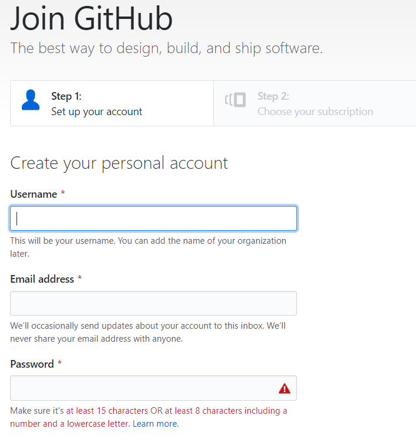
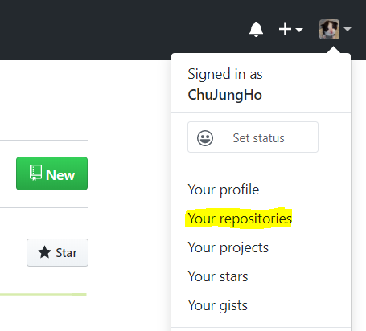
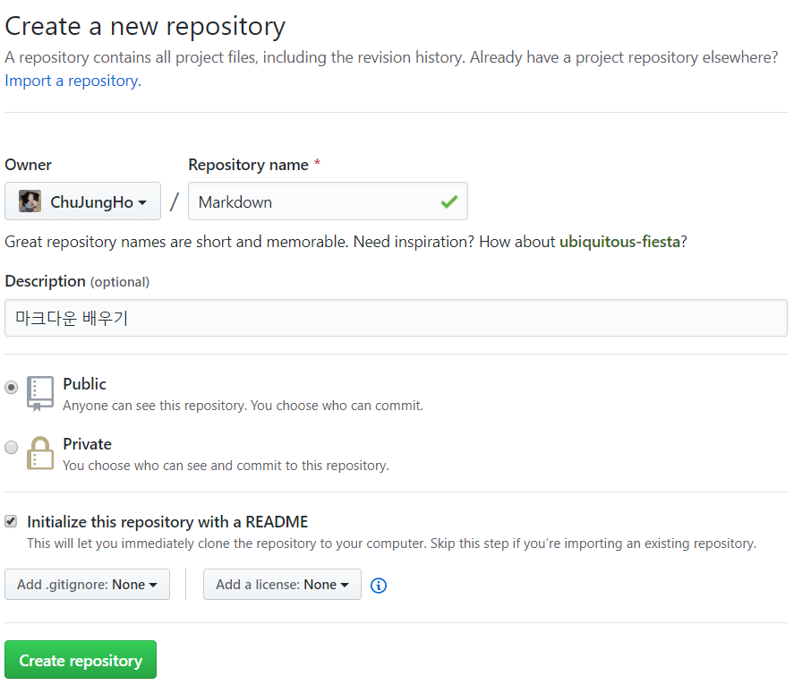
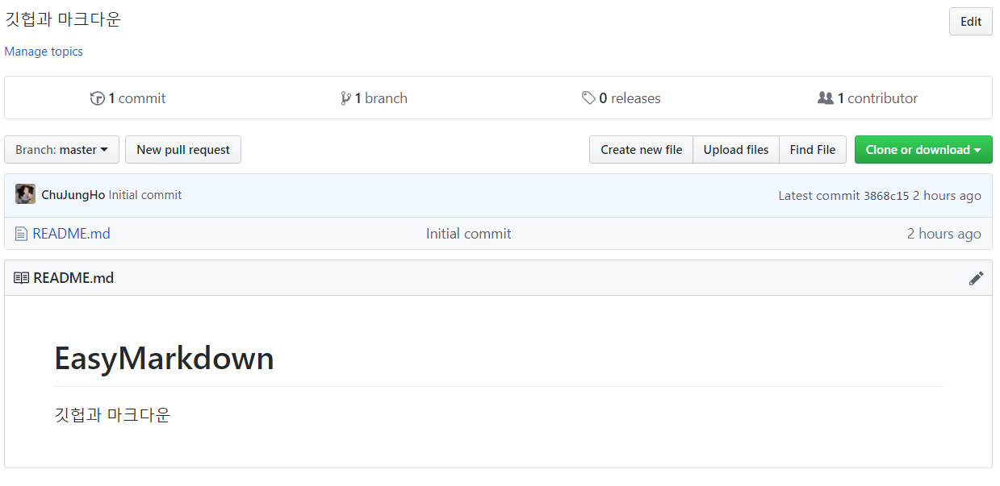

# How to use Markdown

* Before  
`마크다운`에 대해서 배우기 전에 Git에 대해 알아봅시다.

###  Git
1. 깃(Git) 이란? 
  - `Git`은 버전 관리를 위한 도구 -`VCS`  
  - 코드를 작성한 모든 `History`가 저장되기 때문에 오류가 발생할 경우 롤백에 유용
  - `Brench`와`merge`가 가능해 여러 사람간 협업에도 자주 활용  
  (여러 사람이 각자 복사본을 작업해서 다시 한 곳에 합치는 기능)
  
2. GitHub
  - 깃을 설치 없이 웹에서 사용 가능합니다.  
  - `GitHub`을 통해 `Markdown`을 배워봅시다.
  
  
### [GitHub](https://github.com/)에서 `Repository` 만들기
1. `GitHub` 가입하기     
 - `sign in` 통해서 가입을 합니다.


2. `Repository` 생성하기  
  * 오른쪽 상단의 자기 아이콘을 누르고 `Your repositories`를 들어가 `New`를 클릭합니다.  
   
  * 예시처럼 자유롭게 `Repository name`을 작성하고 Repository를 생성합니다.  
   
  * `Create Repository`를 누르면 다음과 같이 Repository가 생성됩니다.  
   
 
### 구름IDE에서 불러오기
1. 새 컨테이너에 `repository` 불러오기  
  - 소스를 GitHub으로 선택하고 로그인 하여 방금 만든 `repository`를 선택합니다.
  - 소프트웨어 스택은 `Blank`를 선택하고 컨테이너를 생성합니다.  
  

## `MarkDown` 배우기
 - 본격적으로 `Markdown`을 배워봅시다.
 
 - 제목(Title) 
  - `Title`은 #를 사용하여 작성합니다.  
   #는 6개 가지 쓸수 있으며 갯수가 많을수록 글씨가 작아집니다.  
   #에 한칸을 띄우고 원하는 글을 치면 제목이 됩니다.
```
# Title
### Title
###### Title
```
코드를 실행하면 다음과 같이 나옵니다.
# Title  
### Title  
###### Title  
 -  리스트
  - 리스트를 사용하면 이 글에서 사용한것 처럼 글을 이쁘게 정렬 할 수 있습니다.
  - 순서가 필요한 리스트는 1.로 필요없는 리스트는 -,+,* 를 사용할수 있습니다.
  ```
        - list
        
        1.list
         - sublist
           * sublist
           + sublist
           
        2.list
  ```   
실행 예시)  

- list
 
1.list
  - sublist
    * sublist
    + sublist
 
2.list 

---
